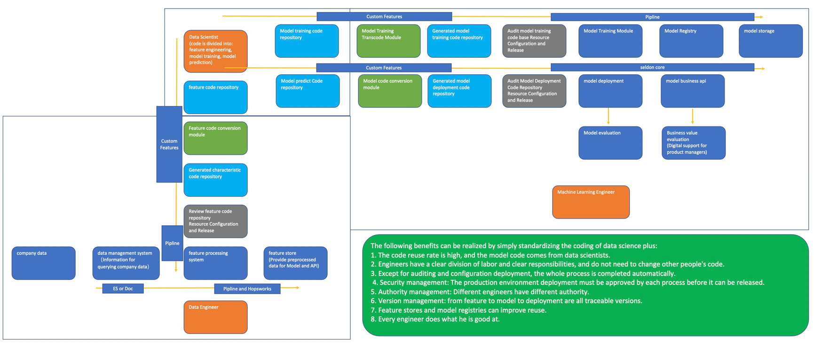

# MLOP
About the MLOps Platform

It aims to clarify the responsibilities of workers and realize rapid deployment in machine learning.

The following benefits can be realized by simply standardizing the coding of data science plus: 
1. The code reuse rate is high, and the model code comes from data scientists. 
2. Engineers have a clear division of labor and clear responsibilities, and do not need to change other people's code. 
3. Except for auditing and configuration deployment, the whole process is completed automatically.
4. Security management: The production environment deployment must be approved by each process before it can be released. 
5. Authority management: Different engineers have different authority. 
6. Version management: from feature to model to deployment are all traceable versions. 
7. Feature stores and model registries can improve reuse. 
8. Every engineer does what he is good at.

